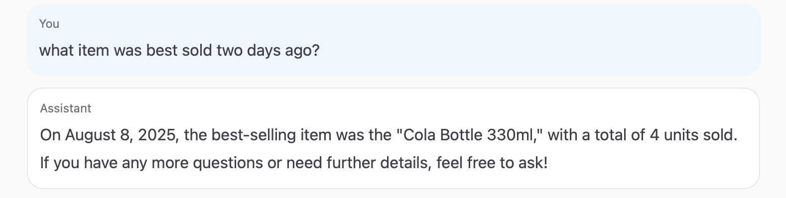
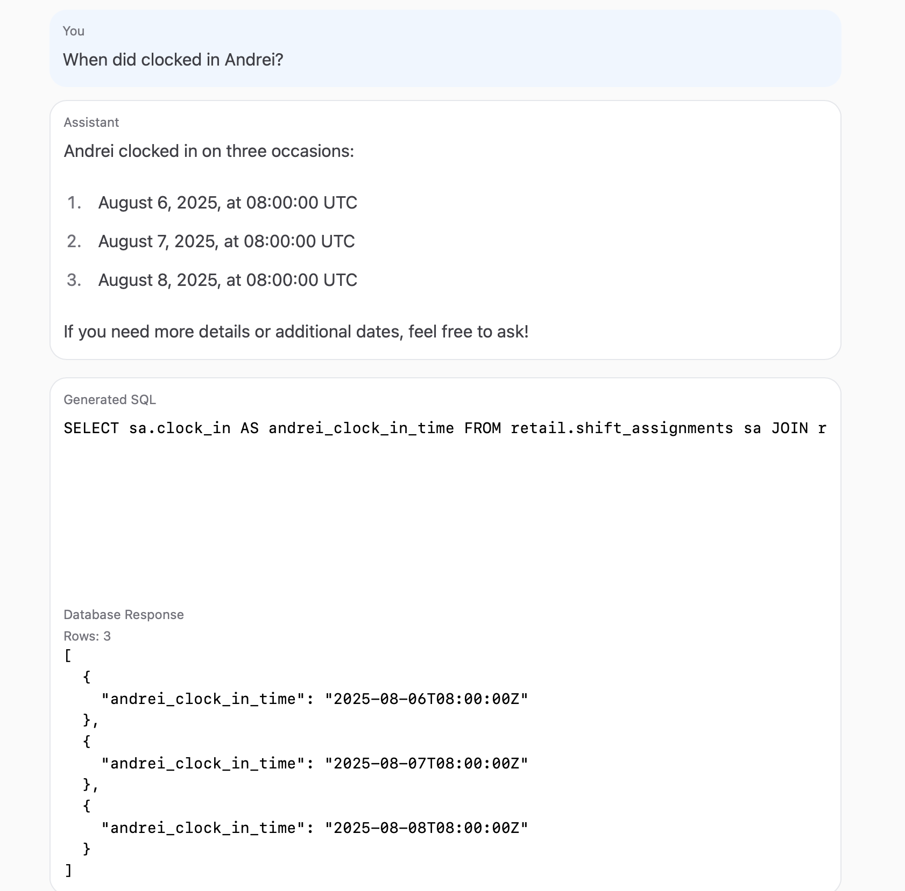
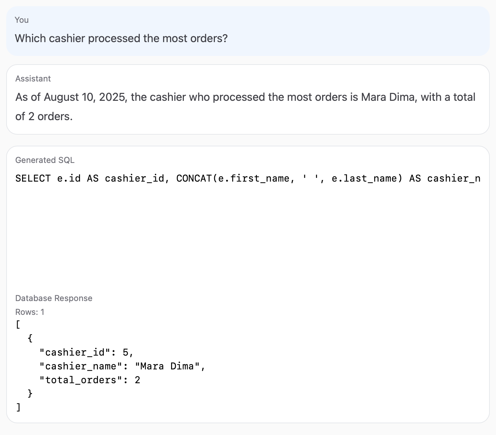

# Agent-based SQL Chatbot (CLI + Web UI)

A production agent that connects to your **PostgreSQL** database, reasons over the schema, generates **read-only SQL**, validates/fixes it, executes the query, and replies in natural language. 
---
You can use it from: 
 - **CLI**: command line interactive mode
 - **local web UI**: chatbot user interface

> ⚠️ The agent executes **SELECT-only** queries in a **read-only** transaction and auto-LIMITs results for safety. No data is mutated.

---

### Demo

<p align="center">
  
  <br><em>Response</em>
</p>

<p align="center">
  
  <br><em>Web UI: generated SQL + DB response panel</em>
</p>

<p align="center">
  
  <br><em>Web UI: generated SQL + DB response panel</em>
</p>


## Features

- **LangGraph pipeline** (Rephrase → Plan SQL → Validate/Fix → Execute → Respond)
- **Conversation-aware** (current session only): follow-ups like “what about yesterday?”
- **Postgres introspection**: tables, columns, PK/FK, plus tiny samples/stats
- **Markdown schema context** (compact) with token budgeting (extensible)
- **CLI** and **Web UI** (FastAPI + React/Vite) with a *Show generated SQL* toggle

---

## Requirements

- **Python** 3.11+  
- **Node.js** 18+ (for the web UI)
- **PostgreSQL** 13+ (local or Docker)
- An **OpenAI API key** (for `gpt-4o-mini` by default)

---

## 1) Configure environment (`keys.env`)

Create a file **at the project root** named `keys.env` with your connection + API settings. The app auto-loads this file.

```dotenv
# Database
DB_HOST=localhost
DB_PORT=5432
DB_NAME=production_data
DB_USER=postgres
DB_PASSWORD=postgres
DB_SCHEMA=retail

# OpenAI
OPENAI_API_KEY=sk-...
OPENAI_MODEL=gpt-4o-mini
# Optional (Azure/OpenRouter/self-hosted gateway)
# OPENAI_API_BASE=https://...

# App
APP_TIMEZONE=Europe/Bucharest
```

> The code uses **pydantic-settings** to read `keys.env`. If you place this file elsewhere, update `src/agent/config.py`.

---

## 2) Bring up Postgres

If you already have a Postgres instance, skip this section.

**Docker (example):**
```bash
docker run --name pg-sql-agent -e POSTGRES_PASSWORD=postgres -p 5432:5432 -d postgres:16
```

Create the database if needed:
```bash
docker exec -it pg-sql-agent psql -U postgres -c 'CREATE DATABASE production_data;'
```

---

## 3) Python setup (venv + deps)

```bash
python3 -m venv .venv
source .venv/bin/activate
python -m pip install --upgrade pip
# core deps
pip install -r requirements.txt # CLI + API
```

---

## 4) Run the CLI (without user interface)

Interactive loop:
```bash
PYTHONPATH=src python src/cli/main.py
# then type questions; commands:  reset  |  exit
```

Sample output:
```
=== Final SQL ===
SELECT ...

=== Result (up to 100 rows) ===
[ { ... } ]
```

Tips:
- The CLI uses your `APP_TIMEZONE` to resolve relative dates.
- `reset` clears the in-memory conversation for this run.

---

## 5) Run the Web UI (local)

### Start the API (FastAPI)
```bash
# from project root
PYTHONPATH=src uvicorn api.main:app --reload --port 8000
```

### Start the frontend (Vite + React)
```bash
cd web
npm i
VITE_API_URL=http://localhost:8000 npm run dev
```

UI controls:
- **Ask** — sends your question
- **Reset conversation** — clears the current session memory (no persistent history)
- **Show generated SQL** — toggles visibility of SQL + DB response panel

---

## How it works

```
User → [Rephrase Node] → [Plan SQL Node] → [Validate/Fix Node] → [Execute] → [Respond]
```

- **Rephrase**: normalizes the question, resolves relative dates using `APP_TIMEZONE` and current time, includes short session history (current run only).
- **Plan SQL**: retrieves/compacts schema context (markdown), selects relevant tables/columns, drafts a **SELECT-only** SQL query.
- **Validate/Fix**: runs `EXPLAIN` and a tiny execution; if it errors, the LLM fixes it with the full schema context (few retries).
- **Execute**: runs the final SQL in a **read-only** transaction and returns up to 100 rows by default.
- **Respond**: generates a natural-language summary; the UI/CLI can also show the final SQL + preview rows.

---

## Contributing

Issues and PRs are welcome! Ideas:
- DB adapters for MySQL/SQLite/BigQuery
- Embedding-based schema retriever
- Streaming responses in the UI
- CSV export of results

---

